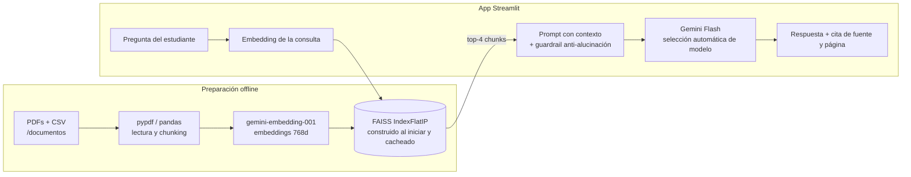

# 🎓 Aulo — Agente RAG de Aula Andina


**Aulo** es un asistente inteligente tipo RAG (Retrieval-Augmented Generation) que responde preguntas de estudiantes de **Aula Andina**, una academia online ficticia para Latinoamérica, basándose exclusivamente en su documentación oficial (4 PDFs + 1 catálogo CSV) y **citando siempre la fuente y la página**.

🔗 **Demo en vivo:** https://aulo-rag-andina.streamlit.app/

## 🧩 El problema que resuelve

El equipo de soporte de Aula Andina recibe todos los días las mismas preguntas: *"¿cuál es la nota para aprobar?"*, *"¿me devuelven la plata?"*, *"¿cuándo llega mi certificado?"*. Las respuestas existen, pero están dispersas en 5 documentos distintos (reglamento, política de reembolsos, FAQ de certificados, programa de becas y catálogo de cursos). Aulo centraliza ese conocimiento en un chat que:

- responde en segundos, 24/7, en español y con tono estudiantil;
- **cita el documento y la página exacta** de cada respuesta;
- **no inventa**: si algo no está documentado, lo dice y deriva a soporte.

## 🏗️ Arquitectura



El índice FAISS **se construye automáticamente en el primer arranque** de la app (leyendo los PDFs por página y el CSV por fila) y queda cacheado con `@st.cache_resource`, por lo que las cargas siguientes son inmediatas. También puede pre-construirse en local con `scripts/construir_indice.py` para versionarlo en el repo.

Además, la app **no depende de un nombre de modelo fijo**: consulta a la API qué modelos Gemini Flash están disponibles para la cuenta y prueba en orden (de más nuevo a más antiguo) hasta encontrar uno con cuota gratuita. Así sobrevive a los retiros y renombres de modelos de Google sin cambiar código.

## 🛠️ Tecnologías

| Componente | Tecnología | Rol |
|---|---|---|
| LLM | Google Gemini Flash con selección automática de modelo (`google-genai`) | Generación de respuestas |
| Embeddings | `gemini-embedding-001` (768 dim.) | Vectorización de chunks y consultas |
| Vector store | FAISS (`faiss-cpu`, IndexFlatIP) | Búsqueda por similitud coseno |
| Interfaz + deploy | Streamlit + Streamlit Community Cloud | Chat web público y gratuito |
| Ingesta | `pypdf` (PDF por página) + `pandas` (CSV por fila) | Lectura de documentos |
| Generación de datos | `fpdf2` | Creación reproducible de los PDFs fuente |

## 📁 Estructura del repositorio

```
aulo-rag/
├── app.py                      # Interfaz Streamlit (chat, chips, sidebar)
├── requirements.txt            # Versiones fijas
├── .env.example                # Plantilla de API key
├── src/
│   └── rag.py                  # Núcleo RAG: chunking, embeddings, FAISS, respuesta
├── scripts/
│   ├── generar_documentos.py   # Crea los 4 PDFs + CSV de Aula Andina
│   ├── construir_indice.py     # (Opcional) pre-construye el índice FAISS
│   └── evaluar.py              # Corre 10 preguntas y guarda evidencia en Markdown
├── documentos/                 # Fuentes de conocimiento (generadas)
├── evidencia del deploy/       # Capturas de la app en producción
└── badge-rag-agente-ia.png     # Badge del challenge
```

## 🚀 Instalación y ejecución local

Requisitos: Python 3.11 y una API key gratuita de [Google AI Studio](https://aistudio.google.com/apikey).

```bash
git clone https://github.com/evelyntec/aulo-rag.git
cd aulo-rag
python -m venv .venv
.venv\Scripts\activate          # Windows  (macOS/Linux: source .venv/bin/activate)
pip install -r requirements.txt
copy .env.example .env          # Windows  (macOS/Linux: cp .env.example .env)
# Editar .env y pegar tu GOOGLE_API_KEY
python scripts/generar_documentos.py   # genera PDFs y CSV
python scripts/construir_indice.py     # construye el índice FAISS
streamlit run app.py
```

## ❓ Preguntas de ejemplo

| # | Pregunta | Fuente esperada |
|---|---|---|
| 1 | ¿Cuál es la nota mínima para aprobar un curso? | reglamento_estudiante.pdf |
| 2 | ¿Qué asistencia mínima necesito para el certificado? | reglamento / faq_certificados |
| 3 | Compré hace 5 días y avancé un 8%, ¿me devuelven todo? | politica_reembolsos.pdf |
| 4 | Llevo 40% del curso hace 3 semanas, ¿cuánto me reembolsan? | politica_reembolsos.pdf |
| 5 | ¿Cuánto tarda la emisión del certificado? | faq_certificados.pdf |
| 6 | ¿Cuánto cuesta reemitir un certificado corregido? | faq_certificados.pdf |
| 7 | ¿Qué becas existen y qué % de descuento dan? | programa_becas.pdf |
| 8 | ¿Cuándo puedo postular a una beca? | programa_becas.pdf |
| 9 | ¿Cuánto cuesta Machine Learning Aplicado y cuándo empieza? | catalogo_cursos.csv |
| 10 | ¿Aula Andina tiene sedes presenciales? | *(no documentado → guardrail)* |

## 💬 Respuestas reales del agente

Respuestas obtenidas de la app en producción (https://aulo-rag-andina.streamlit.app/):

**Pregunta:** ¿Qué becas puedo pedir y cuándo?

> En Aula Andina puedes postular a las siguientes becas:
>
> - **Beca Andina Total:** 100% de descuento.
> - **Beca Mujer STEM:** 60% de descuento.
> - **Beca Impulso:** 50% de descuento.
> - **Beca Alumni:** 25% de descuento permanente (esta se activa automáticamente sin necesidad de postulación).
>
> Puedes realizar tu postulación en dos convocatorias anuales: del **1 al 15 de marzo** y del **1 al 15 de agosto**. Fuera de esas fechas no se reciben postulaciones.
>
> Fuente: programa_becas.pdf, página 1

**Pregunta:** ¿Cuánto cuesta el curso de Machine Learning Aplicado y cuándo empieza?

> ¡Hola! El curso 'Machine Learning Aplicado' tiene un precio de 149 USD y su fecha de inicio es el 5 de octubre de 2026 (2026-10-05).
>
> Fuente: catalogo_cursos.csv

**Pregunta:** ¿Aula Andina tiene sedes presenciales en Santiago?

> Esa información no está en la documentación de Aula Andina. Te recomiendo escribir a soporte@aulaandina.lat para resolverlo.

*(Esta última demuestra el guardrail anti-alucinación: la pregunta no está cubierta por ningún documento y el agente lo reconoce en vez de inventar.)*

## 🛡️ Guardrail anti-alucinación

El prompt del sistema obliga al modelo a responder únicamente con el contexto recuperado. Ante preguntas fuera de la documentación (ej.: "¿tienen sedes presenciales?"), Aulo responde que la información no está documentada y deriva a `soporte@aulaandina.lat`, en lugar de inventar.

## 📸 Evidencia de deploy

- **URL pública:** https://aulo-rag-andina.streamlit.app/
- Captura de la app funcionando en producción:


Más capturas (respuestas de becas, catálogo CSV y guardrail) en la carpeta [`evidencia del deploy`](evidencia%20del%20deploy).

## ⚠️ Limitaciones y próximos pasos

- La capa gratuita de Gemini tiene límites de solicitudes por minuto y por día; bajo carga alta habría que agregar reintentos con backoff.
- La búsqueda es puramente semántica (top-4); un re-ranker o búsqueda híbrida (BM25 + vectores) mejoraría preguntas muy específicas del catálogo.
- Próximos pasos: memoria conversacional multi-turno con reformulación de preguntas, métricas de calidad automatizadas (RAGAS) y panel de preguntas frecuentes para el equipo de soporte.

---
Proyecto desarrollado para el challenge de Alura · 2026
